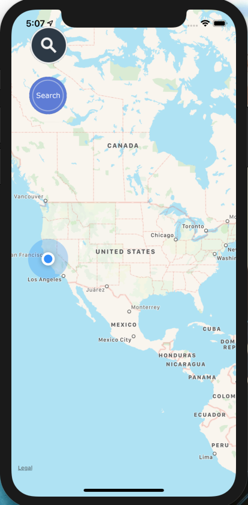
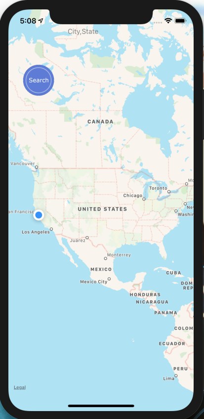
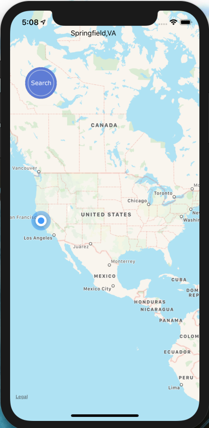
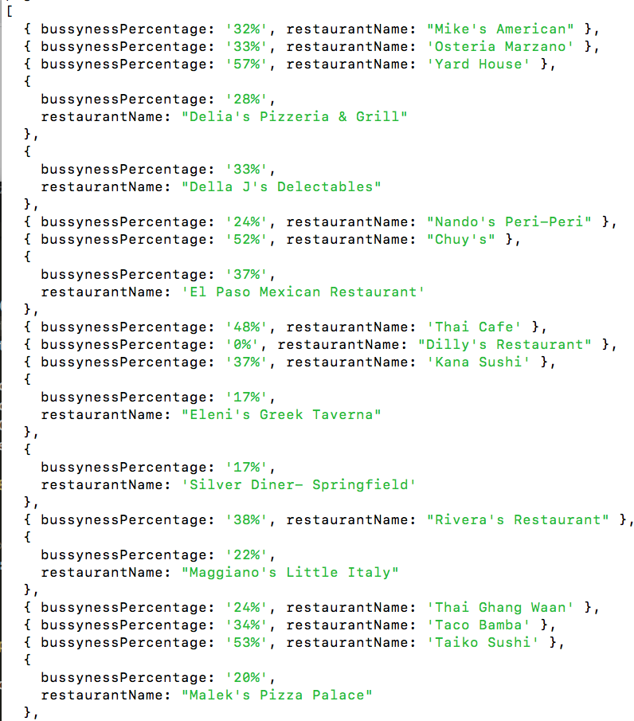
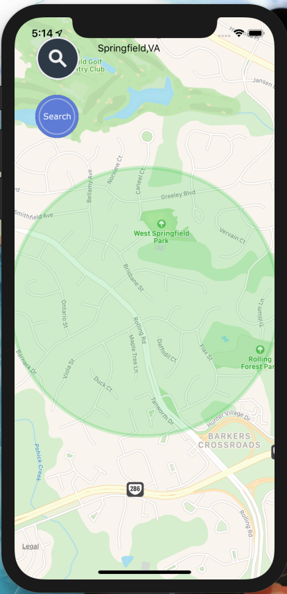
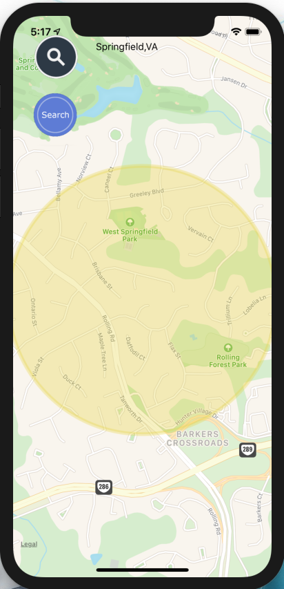

&nbsp; &nbsp; &nbsp; 

## UberEats_HotZonesBackEnd

## Table of contents
* [General info](#general-info)
* [Technologies](#technologies)
* [images](#images)

## General info

Using Puppeteer.js to scrape data from google maps and Express.js to collect and fetch data. The application displays information to a user about how busy the restaurants are around a specific US location.
the app will start with a map showing the user's current location, a search input fill, and a search button.

## Technologies

Project is created with:
* React version: 16.8
* Expo version: 35.0
* Express version: 4.17

## Images

###### tapping on the search icon will reveal the input field. 
 

 

###### then hit search and wait. Meanwhile, the backend is collecting the information requested base on the location inserted.

###### after the server finished collecting the information the app will display the location with a color area representing the busyness percentage.
  

